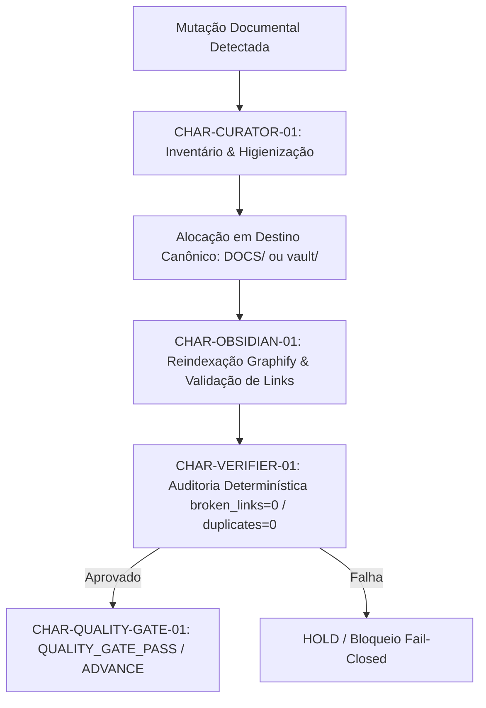

# 07_DOC_TREE_CURATORSHIP.md — Contrato Operacional de Curatela Contínua da Árvore Documental

## 1. Diretiva de Soberania e Delegação
Em conformidade com a diretiva do Proprietário expressa em `CALL-DOC-TREE-CURATOR-OWNERSHIP-001`, a manutenção e organização da árvore documental do `hangar_v1` é delegada de forma contínua e autônoma à tríade operacional **CHAR-CURATOR-01** (N09), **CHAR-OBSIDIAN-01** (N10) e **CHAR-VERIFIER-01** (N08), eliminando a dependência de intervenção manual direta do Proprietário a cada alteração documental.

---

## 2. Matriz de Responsabilidades da Tríade

| Agente / Nível | Papel Primário | Responsabilidades Específicas |
| :--- | :--- | :--- |
| **CHAR-CURATOR-01** (N09) | **Custódia & Curatela Factual** | - Inventário contínuo de artefatos documentais. - Reconciliação imediata de documentação após mutações. - Detecção e eliminação de documentos obsoletos ou duplicatas ativas. - Garantia de que novos documentos sejam alocados nos destinos canônicos (`DOCS/` ou `vault/`). |
| **CHAR-OBSIDIAN-01** (N10) | **Estrutura Espacial & Grafo** | - Indexação e geração do Grafo Unificado de Conhecimento (Graphify). - Manutenção da integridade de wikilinks (`[[...]]`). - Higienização da raiz do Vault (preservação estrita das 11 seções canônicas e `INDEX.md`). - Projeção espacial em Obsidian Canvas (`Master_World.canvas` e `curator_downplant.canvas`). |
| **CHAR-VERIFIER-01** (N08) | **Auditoria Determinística** | - Verificação matemática fail-closed dos invariantes documentais. - Emissão de evidências criptográficas (`sha256`) sobre integridade factual. - Bloqueio de avanço se detectada qualquer inconformidade documental. |

---

## 3. Invariantes Normativos Determinísticos (Fail-Closed)

1. **`REALIDADE == MAPA`:**
   O mapa do grafo de conhecimento e o índice do Vault devem corresponder 1:1 à estrutura física de diretórios e arquivos reais no disco. Não são permitidos caminhos fictícios ou stubs sem implementação.

2. **`BROKEN_LINKS == 0`:**
   Todo wikilink (`[[...]]`) presente no Vault ou na pasta `DOCS/` deve resolver para um arquivo existente no disco. Se houver link quebrado, o Quality Gate emite veredito de falha e bloqueia a promoção.

3. **`DUPLICATE_ACTIVE_DOCS == 0`:**
   É estritamente vedada a duplicidade de documentos ativos ou a permanência de arquivos soltos na raiz do Hangar. Toda documentação deve residir:
   - Em `hangar_v1/DOCS/` (especificações de sprint, modelos e relatórios de curadoria).
   - Em `hangar_v1/vault/<SEÇÃO>/` (conhecimento canônico navegável do Vault).

4. **`PRESERVAÇÃO DE ESCOPO`:**
   A curatela documental não pode mover, renomear ou mutar código-fonte (`.py`), scripts de automação, suítes de teste ou regras de política (`.rego`, `.cedar`), exceto os apontamentos de links documentais correspondentes.

5. **`HOLD EM AMBIGUIDADE`:**
   Qualquer dúvida, conflito de nomes ou ambiguidade estrutural não resolvida deve acionar imediatamente a política `HOLD / INCONCLUSIVE`, impedindo mutações não autorizadas.

---

## 4. Fluxo Operacional de Reconciliação Automática

---

## 5. Rastreabilidade e Evidências
- **Contrato ID:** `DOC-TREE-CURATOR-01`
- **Diretiva de Origem:** `CALL-DOC-TREE-CURATOR-OWNERSHIP-001`
- **Escopo Ativo:** `syntheon_adk/hangar_v1/DOCS/` e `syntheon_adk/hangar_v1/vault/`
- **Mecanismo de Teste:** `test_06_doc_tree_curatorship_invariants` em `test_hangar_v1_sprint_01.py`
