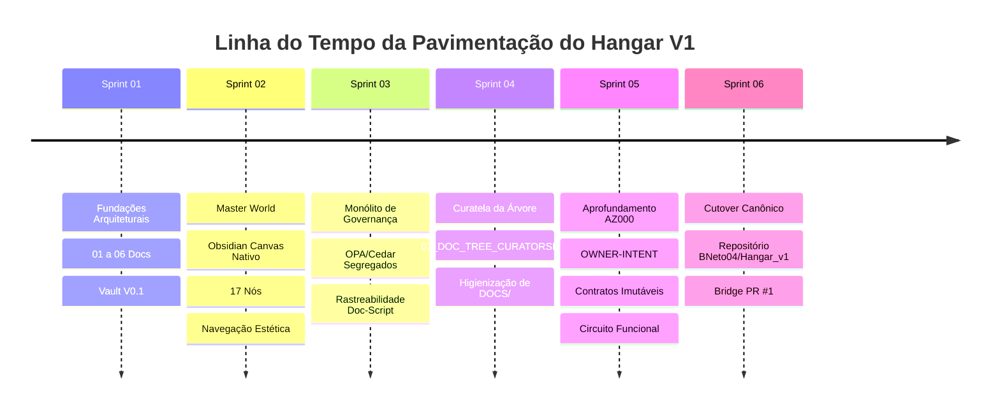

# 09_HANGAR_GOVERNANCE_ROADTRACE.md — Rastreabilidade Histórica e Pavimentação até a Governança Plena

## 1. Identificação e Soberania
- **Artefato:** `DOCS/09_HANGAR_GOVERNANCE_ROADTRACE.md`
- **Origem:** `CALL-HANGAR-GOVERNANCE-ROADTRACE-001` (`CG-000104`)
- **Propósito:** Registrar factual e continuamente a pavimentação real percorrida pelo Hangar V1, os pontos de atrito, as correções arquiteturais e os critérios objetivos necessários para alcançar o estado de **GOVERNANÇA PLENA**.
- **Curatela:** Delegada continuamente ao **CHAR-CURATOR-01** (N09) com apoio de **CHAR-OBSIDIAN-01** (N10) e **CHAR-VERIFIER-01** (N08).

---

## 2. Linha do Tempo Factual da Pavimentação (Sprints 01 a 06)

| Fase / Sprint | Entregáveis Fatuais | Cards Homologados (T5) | Evidências e Traces |
| :--- | :--- | :--- | :--- |
| **Sprint 01: Fundações** | `01_WORLD_MODEL` a `06_TRACE_SCHEMA`, Vault V0.1 com 11 seções, motor Graphify nativo e suíte determinística. | `t_hangar_sprint_01` | Testes 5/5 PASS, envelopes de verificação N08. |
| **Sprint 02: Master World** | `Master_World.canvas` com 17 nós, 24 arestas, metadados canônicos de 10 campos e navegação estética `[[...]]`. | `t_hangar_master_world_p1` a `p4`, `t_master_world_nav_aesthetic_01` | Zero links quebrados, layout balanceado Obsidian. |
| **Sprint 03: Governança Monolítica** | Segregação Cedar (Authority) e OPA (Gates), consolidação do monólito `GOVERNANCE.md` (15.943 bytes, 14 seções) e mapeamento de 18 scripts. | `t_governance_opa_cedar_p1`, `p2`, `t_governance_monolith_01`, `t_governance_doc_script_linkage_01`, `t_governance_doc_monolith_index_01` | Monólito unificado em `vault/GOVERNANCE/`, eliminação de fragmentações. |
| **Sprint 04: Curatela da Árvore** | `07_DOC_TREE_CURATORSHIP.md`, purga de arquivos soltos na raiz, segregação em `DOCS/` e invariante `duplicate_active_docs == 0`. | `t_hangar_docs_move_curator_down_01`, `t_doc_tree_curator_ownership_01` | Teste `test_06` integrado, raiz limpa do Vault. |
| **Sprint 05: Circuito AZ000** | `08_AZ000_OWNER_INTENT_SPEC.md`, contratos imutáveis, 5 portas Down Plant e circuito `circuit.py` com comportamento fail-closed. | `t_az000_owner_intent_depth_01` | Teste `test_07` (ACCEPT, HOLD, REJECT, TAMPER) aprovado em 1.982s. |
| **Sprint 06: Cutover Canônico** | Repositório autônomo `BNeto04/Hangar_v1`, branch permanente `bridge-chatgpt-antigravity`, PR #1 de bridge e 125 cards sincronizados. | `t_hangar_v1_repo_migration_01` | `CUTOVER_MANIFEST.md`, PR #2 syntheon_adk congelada. |

---

## 3. Registro de Atritos, Desvios Detectados e Correções Aplicadas

1. **Tentativa de Fragmentação da Governança:**
   - *Desvio:* Criação inicial de múltiplas subpastas em `vault/GOVERNANCE/` que inflavam a navegação e quebravam links relativos.
   - *Correção:* Purgadas todas as subpastas e criado o monólito canônico integral `GOVERNANCE.md` com índice navegável interno.
   - *Lição:* A documentação de governança central deve permanecer monolítica enquanto não houver necessidade estrita de segregação por máquina/runtime.

2. **Proliferação de Documentos Soltos na Raiz:**
   - *Desvio:* Arquivos `.md` de especificações e canvas de curadoria eram gerados soltos na raiz de `hangar_v1` e na raiz do `vault/`.
   - *Correção:* Movimentação física de todos os arquivos documentais para `DOCS/` e ajuste de `char_curator.py` para operar com persistência em memória (`None`) por padrão.
   - *Lição:* Invariante `duplicate_active_docs == 0` deve ser validado algorítmicamente em testes automatizados (`test_06`).

3. **Bloqueio de Subprocessos por Credenciais Interativas:**
   - *Desvio:* Chamadas ao git credential helper congelavam na ausência de terminal interativo no Windows.
   - *Correção:* Configurado `GCM_INTERACTIVE=never`, `GIT_TERMINAL_PROMPT=0` e implementada extração determinística de credenciais direto do `.git/config`.
   - *Lição:* Ferramental de background daemon nunca pode invocar prompts interativos de SO.

---

## 4. Estado Atual da Governança (Taxonomia Normativa)

### A. IMPLEMENTED (Homologado e Funcional em T5)
- [x] Soberania e Soberano: Diretivas do Proprietário têm primazia absoluta.
- [x] Regra Fail-Closed: Qualquer ambiguidade ou inconsistência bloqueia a mutação (`HOLD/REJECT`).
- [x] Planta Territorial: 11 seções top-level canônicas no Vault Obsidian.
- [x] Master World Canvas: Visualização espacial com 17 nós, 24 arestas e navegação por wikilinks.
- [x] Contrato de Curatela Contínua (`07_DOC_TREE_CURATORSHIP.md`): Custódia ativa da tríade N09/N10/N08.
- [x] Cômodo Funcional OWNER-INTENT (`AZ000`): Ingestão, normalização, validação, selagem SHA256 e handoff ao Planner N01.
- [x] Repositório Canônico Oficial (`BNeto04/Hangar_v1`): Canal de bridge permanente PR #1 e espelho Git sincronizado com 125 cards.
- [x] Suíte de Testes Determinísticos: 7 testes cobrindo deliverables, grafo, invariantes, curatela e circuito AZ000.

### B. DOCUMENTED_ONLY (Especificado na Governança, mas sem Runtime Dedicado)
- [ ] Regras de Autoridade em Cedar (`hangar_authority.cedar`): Sintaxe e modelo definidos, mas avaliação executada via lógica Python e policies internas.
- [ ] Políticas de Quality Gate em OPA/Rego (`gate_deliberation.rego`): Regras de gate especificadas, deliberadas no momento via `CharQualityGateAgent`.
- [ ] Slots de UI do Cockpit: Especificados na arquitetura conceitual, aguardando aprofundamento do território `AZ003 COCKPITS`.

### C. IMPLEMENTATION_GAP (Lacunas Factualmente Identificadas)
- **GAP-001 (Runtime Cedar Embutido):** Falta integrar o binário/engine oficial do Cedar para avaliação de autoridade em tempo real.
- **GAP-002 (Engine OPA/WASM):** Falta carregar policies Rego diretamente em um motor OPA embutido para deliberação externa.
- **GAP-003 (Cockpit Visual de Evidências):** Falta interface dedicada para inspeção em tempo real dos envelopes criptográficos na pasta `envelopes/`.

### D. KNOWN_BUT_NOT_DECOMPOSED (Mapeados na Planta, mas Não Aprofundados)
- Territórios `AZ001 PLANT`, `AZ002 INTELLIGENCE`, `AZ003 COCKPITS`, `AZ004 CAPABILITIES`, `AZ005 MACHINES`, `AZ006 PORTS`, `AZ007 EXTERNAL`, `AZ008 TRACE`, `AZ009 PRODUCTS`.
- Protocolo de Federação Multi-Colmeia para replicação e sincronização entre múltiplos Hangares.

### E. CANDIDATE_IMPROVEMENT (Melhorias Identificadas para Avaliação Posterior)
- *CI Determinístico com GitHub Actions:* Workflow de validação contínua executando a suíte de testes e o Verifier N08 a cada PR.
- *Gerador Automático de Diagramas Mermaid:* Geração dinâmica de diagramas de sequência a partir dos schemas de portas do Hangar.
- *Tagging e Releases Automáticas:* Criação de git tags (`v1.0.0-sprint01`, etc.) a cada promoção T5 em lote.

---

## 5. Critérios Objetivos para Declarar GOVERNANÇA_PLENA

Para que a Governança do Hangar V1 seja promovida do estado atual para **GOVERNANÇA PLENA**, todos os seguintes 6 critérios objetivos devem ser rigorosamente satisfeitos e comprovados com evidências determinísticas:

1. **Cobertura Territorial Completa:** Todos os 10 territórios canônicos (`AZ000` a `AZ009`) devem possuir ao menos 1 cômodo aprofundado até circuito funcional com testes E2E.
2. **Engines Formais de Política (Zero Python Heurístico):** Cedar e OPA integrados em runtimes determinísticos isolados para todas as decisões de autoridade e gate.
3. **Enforcement Automatizado via CI/CD:** GitHub Actions com branch protection impedindo merge ou avanço se qualquer check (testes, broken links, integridade de hashes) falhar.
4. **Zero Intervenção Manual Operacional:** A esteira opera de ponta a ponta desde a intenção bruta até a entrega em T4 sem necessidade de comandos manuais do Proprietário.
5. **Rastreabilidade Factual 100% Auditável:** Grafo de conhecimento, Planta territorial, código executável e espelho Kanban mantêm sincronização matemática exata com zero discrepâncias.
6. **Homologação Soberana Final:** Veredito explícito do Proprietário conferindo o selo de `GOVERNANÇA_PLENA`.

## 6. Invariante Soberano de Propósito (Purpose-First)
Consulte [`10_PURPOSE_FIRST_INVARIANT.md`](10_PURPOSE_FIRST_INVARIANT.md) para a codificação das 8 dimensões obrigatórias em toda ação material e políticas fail-closed contra mutações puramente estéticas ou duplicadas.
