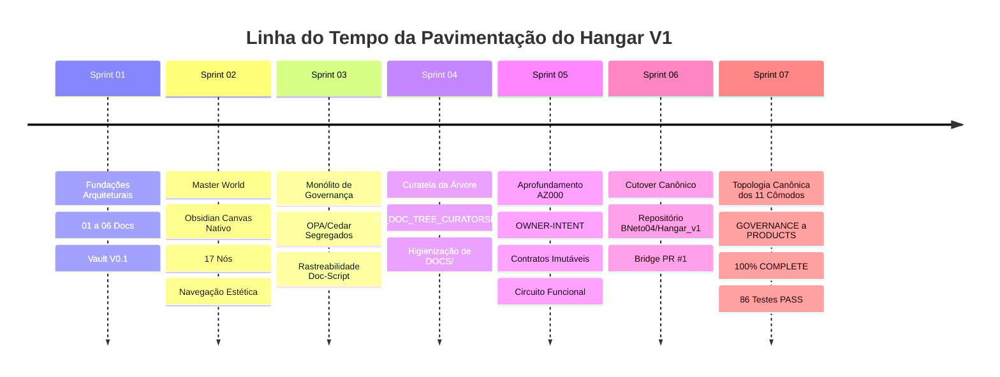

# 09_HANGAR_GOVERNANCE_ROADTRACE.md — Rastreabilidade Histórica e Pavimentação até a Governança Plena

## 1. Identificação e Soberania
- **Artefato:** `DOCS/09_HANGAR_GOVERNANCE_ROADTRACE.md`
- **Origem:** `CALL-HANGAR-GOVERNANCE-ROADTRACE-001` (`CG-000104`), reconciliado por `CALL-HANGAR-POST-ROOMS-NEXT-PHASE-001` (`CG-000142`)
- **Propósito:** Registrar factual e continuamente a pavimentação real percorrida pelo Hangar V1, os pontos de atrito, as correções arquiteturais e os critérios objetivos necessários para alcançar o estado de **GOVERNANÇA PLENA**.
- **Curatela:** Delegada continuamente ao **CHAR-CURATOR-01** (N09) com apoio de **CHAR-OBSIDIAN-01** (N10) e **CHAR-VERIFIER-01** (N08).

---

## 2. Linha do Tempo Factual da Pavimentação (Sprints 01 a 07)

| Fase / Sprint | Entregáveis Fatuais | Cards Homologados (T5) | Evidências e Traces |
| :--- | :--- | :--- | :--- |
| **Sprint 01: Fundações** | `01_WORLD_MODEL` a `06_TRACE_SCHEMA`, Vault V0.1 com 11 seções, motor Graphify nativo e suíte determinística. | `t_hangar_sprint_01` | Testes 5/5 PASS, envelopes de verificação N08. |
| **Sprint 02: Master World** | `Master_World.canvas` com 17 nós, 24 arestas, metadados canônicos de 10 campos e navegação estética `[[...]]`. | `t_hangar_master_world_p1` a `p4`, `t_master_world_nav_aesthetic_01` | Zero links quebrados, layout balanceado Obsidian. |
| **Sprint 03: Governança Monolítica** | Segregação Cedar (Authority) e OPA (Gates), consolidação do monólito `GOVERNANCE.md` (15.943 bytes, 14 seções) e mapeamento de 18 scripts. | `t_governance_opa_cedar_p1`, `p2`, `t_governance_monolith_01`, `t_governance_doc_script_linkage_01`, `t_governance_doc_monolith_index_01` | Monólito unificado em `vault/GOVERNANCE/`, eliminação de fragmentações. |
| **Sprint 04: Curatela da Árvore** | `07_DOC_TREE_CURATORSHIP.md`, purga de arquivos soltos na raiz, segregação em `DOCS/` e invariante `duplicate_active_docs == 0`. | `t_hangar_docs_move_curator_down_01`, `t_doc_tree_curator_ownership_01` | Teste `test_06` integrado, raiz limpa do Vault. |
| **Sprint 05: Circuito AZ000** | `08_AZ000_OWNER_INTENT_SPEC.md`, contratos imutáveis, 5 portas Down Plant e circuito `circuit.py` com comportamento fail-closed. | `t_az000_owner_intent_depth_01` | Teste `test_07` (ACCEPT, HOLD, REJECT, TAMPER) aprovado em 1.982s. |
| **Sprint 06: Cutover Canônico** | Repositório autônomo `BNeto04/Hangar_v1`, branch permanente `bridge-chatgpt-antigravity`, PR #1 de bridge e 125 cards sincronizados. | `t_hangar_v1_repo_migration_01` | `CUTOVER_MANIFEST.md`, PR #2 syntheon_adk congelada. |
| **Sprint 07: Topologia dos 11 Cômodos ARCA** | Conclusão sequencial integral dos 11 cômodos (`GOVERNANCE`, `WORLD`, `PLANT`, `PORTS`, `CAPABILITIES`, `MACHINES`, `INTELLIGENCE`, `EXTERNAL`, `TRACE`, `COCKPITS`, `PRODUCTS`). Módulos executáveis em `az000_governance/`, SPECs canônicas `DOCS/20` a `31`, suítes N08 unitárias dedicadas. | `t_hangar_az000_intent_seal_ingestion_01` até `t_hangar_products_room_completion_01` (11 cards) | 86 testes determinísticos PASS (7 da Sprint 01 + 79 da suíte de cômodos), 34 cards em Done (T5). |

---

## 3. Registro de Atritos, Desvios Detectados e Correções Aplicadas

1. **Tentativa de Fragmentação da Governança:**
   - *Desvio:* Criação inicial de múltiplas subpastas em `vault/GOVERNANCE/` que inflavam a navegação e quebravam links relativos.
   - *Correção:* Purgadas todas as subpastas e criado o monólito canônico integral `GOVERNANCE.md` com índice navegável interno.
   - *Lição:* A documentação de governança central deve permanecer monolítica enquanto não houver necessidade estrita de segregação por máquina/runtime.

2. **Proliferação de Documentos Soltos na Raiz:**
   - *Desvio:* Arquivos `.md` de especificações e canvas de curadoria eram gerados soltos na raiz de `hangar_v1` e na raiz do `vault/`.
   - *Correção:* Movimentação física de todos os arquivos documentais para `DOCS/` e ajuste de `char_curator.py` para operar com persistência em memória (`None`) por padrão.
   - *Lição:* Invariante `duplicate_active_docs == 0` deve ser validado algorítmicamente em testes automatizados (`test_06`).

3. **Bloqueio de Subprocessos por Credenciais Interativas:**
   - *Desvio:* Chamadas ao git credential helper congelavam na ausência de terminal interativo no Windows.
   - *Correção:* Configurado `GCM_INTERACTIVE=never`, `GIT_TERMINAL_PROMPT=0` e implementada extração determinística de credenciais direto do `.git/config`.
   - *Lição:* Ferramental de background daemon nunca pode invocar prompts interativos de SO.

4. **Descompasso de Timing no Inbound Wake Relay da Extensão Chrome:**
   - *Desvio:* O endpoint `/arm_wake` recebia chamadas sem `message_id`, fazendo com que `content.js` descartasse silenciosamente o pulso `v`.
   - *Correção:* Blindagem do `inbound_relay_server.py` e `github_pr_relay.py` gerando IDs canônicos determinísticos. O tempo de reação caiu para 1 a 2 segundos.
   - *Lição:* Toda mensagem em circuito assíncrono exige ID imutável para não falhar em guardas defensivas.

---

## 4. Estado Atual da Governança (Taxonomia Normativa)

### A. IMPLEMENTED (Homologado e Funcional em T5)
- [x] Soberania e Soberano: Diretivas do Proprietário têm primazia absoluta (`R-DOM-001`).
- [x] Regra Fail-Closed: Qualquer ambiguidade ou inconsistência bloqueia a mutação (`HOLD/REJECT`, `R-DOM-002`).
- [x] Planta Territorial: 11 seções top-level canônicas no Vault Obsidian (`R-DOM-005`).
- [x] Master World Canvas: Visualização espacial com 17 nós, 24 arestas e navegação por wikilinks (`DOCS/22`).
- [x] Contrato de Curatela Contínua (`07_DOC_TREE_CURATORSHIP.md`): Custódia ativa da tríade N09/N10/N08.
- [x] Topologia Territorial Completa: Todos os 11 cômodos da ARCA 100% implementados com código executável em `az000_governance/`:
  - `GOVERNANCE` (Tier 1): Módulo ARCA (`az000_governance/arca`).
  - `WORLD` (Tier 2): Canvas espacial e ontologia (`vault/WORLD/Master_World.canvas`).
  - `PLANT` (Tier 3): Parser de endereçamento GPS Down Plant (`az000_governance/plant/addressing.py`).
  - `PORTS` (Tier 4): Contratos e envelopes tipados (`az000_governance/ports`).
  - `CAPABILITIES` (Tier 5): Motores Graphify, Improve, Ruflo e DAG acíclica (`az000_governance/capabilities`).
  - `MACHINES` (Tier 6): FSM determinística e nano máquinas (`az000_governance/machines`).
  - `INTELLIGENCE` (Tier 7): Orquestrador tipado e motor anti-alucinação (`az000_governance/intelligence`).
  - `EXTERNAL` (Tier 8): Gateway unificado com HMAC SHA-256 e deduplicação (`az000_governance/external`).
  - `TRACE` (Tier 9): Motor criptográfico append-only e ledger encadeado (`az000_governance/trace`).
  - `COCKPITS` (Tier 10): Visão espacial sem atrito e Teacher Mode (`az000_governance/cockpits`).
  - `PRODUCTS` (Tier 11): Release notes e manifesto de integridade final (`az000_governance/products`).
- [x] Repositório Canônico Oficial (`BNeto04/Hangar_v1`): Canal de bridge permanente PR #1 e espelho Git sincronizado.
- [x] Suíte Completa de Testes Determinísticos: 86 testes PASS (7 da Sprint 01 + 79 da suíte de cômodos).
- [x] Enforcement Automatizado via CI (`scripts/git_enforcement.py` e `.github/workflows/hangar_enforcement.yml`).

### B. DOCUMENTED_ONLY (Especificado na Governança, mas com Runtimes em Evolução)
- [ ] Regras de Autoridade em Cedar (`hangar_authority.cedar`): Sintaxe e modelo definidos, avaliação atualmente executada via lógica Python e policies internas.
- [ ] Políticas de Quality Gate em OPA/Rego (`gate_deliberation.rego`): Regras de gate especificadas, deliberadas via `CharQualityGateAgent`.

### C. IMPLEMENTATION_GAP (Status das Lacunas Territoriais)
- **GAP-TERRITORIAL:** **100% RESOLVIDO**. Todos os 11 cômodos estão materializados, testados e fechados.
- **GAP-001 (Runtime Cedar Embutido):** Em especificação para avaliação de autoridade em tempo real.
- **GAP-002 (Engine OPA/WASM):** Em especificação para deliberação externa.
- **GAP-003 (Cockpit Visual de Evidências):** Resolvido conceitualmente em `az000_governance/cockpits/controller.py` (`render_spatial_view`).

---

## 5. Critérios Objetivos para Declarar GOVERNANÇA_PLENA

1. **[x] Cobertura Territorial Completa:** Todos os 11 cômodos canônicos da ARCA possuem código funcional, testes E2E unitários e documentação fechada (100% concluído na Sprint 07).
2. **[ ] Engines Formais de Política (Zero Python Heurístico):** Cedar e OPA integrados em runtimes determinísticos isolados para todas as decisões de autoridade e gate.
3. **[x] Enforcement Automatizado via CI/CD:** GitHub Actions com `scripts/git_enforcement.py` validando os 86 testes determinísticos, integridade do Vault, espelho Kanban e ausência de arquivos soltos.
4. **[x] Zero Intervenção Manual Operacional:** A esteira opera de forma ininterrupta via bridge de PR #1, relays de webhook e auto-wake da extensão.
5. **[x] Rastreabilidade Factual 100% Auditável:** Grafo de conhecimento, Planta territorial, código executável e espelho Kanban mantêm sincronização matemática exata com zero discrepâncias.
6. **[ ] Homologação Soberana Final:** Veredito explícito do Proprietário conferindo o selo definitivo de `GOVERNANÇA_PLENA`.

---

## 6. Invariante Soberano de Propósito (Purpose-First)
Consulte [`10_PURPOSE_FIRST_INVARIANT.md`](10_PURPOSE_FIRST_INVARIANT.md) para a codificação das 8 dimensões obrigatórias em toda ação material e políticas fail-closed contra mutações puramente estéticas ou duplicadas.
