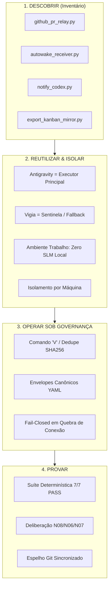

# 11_VIGIA_PONTE_SIMPLIFY_REUSE.md — Arquitetura Simplificada e Reuso do Vigia da Ponte

## 1. Contexto e Intenção do Proprietário
- **Artefato:** `DOCS/11_VIGIA_PONTE_SIMPLIFY_REUSE.md`
- **Origem:** `CALL-VIGIA-PONTE-SIMPLIFY-REUSE-001` (`CG-000109`)
- **Princípio:** Em conformidade com o [`10_PURPOSE_FIRST_INVARIANT.md`](10_PURPOSE_FIRST_INVARIANT.md), nada existente é substituído ou duplicado sem propósito operacional comprovado. O modelo do Vigia da Ponte foi validado, simplificado e organizado em **4 Blocos Operacionais**.

---

## 2. Os 4 Blocos da Arquitetura do Vigia da Ponte

### Bloco 1: DESCOBRIR (Inventário Factual do que Já Existe)
1. `github_pr_relay.py`: Daemon de polling que consome o GitHub PR #1 do `BNeto04/Hangar_v1`, deduplica `MESSAGE_ID`/`COMMENT_ID`, escreve em `conversa de ia.txt` e posta comentários formatados.
2. `autowake_receiver.py`: Monitor local de arquivo de conversa (`conversa de ia.txt`), detecta blocos `CALL_ID` com SHA256 e dispara o autowake para o executor.
3. `notify_codex.py`: Emissor de callback que enfileira `v` na sessão do Codex (`codex queue --thread ...`).
4. `export_kanban_mirror.py`: Exportador do estado SQLite do Hermes Kanban para `kanban/kanban_state.json` com push automático no Git.

### Bloco 2: REUTILIZAR / MONTAR MÍNIMO (Isolamento e Papéis)
- **Executor Principal (Trabalho/Local):** `Antigravity` (Pairing, raciocínio de engenharia, refatoração, suítes de testes, sem dependência de SLMs pesados no PC de trabalho).
- **Vigia / Sentinela do Nó Casa:** **`Sentinela_PC_Casa`** (Monitor de continuidade, autowake, verificação de liveness e fallback de execução).
- **Adaptação para Máquina de Trabalho (`WORK_PC`):**
  * O ambiente de trabalho opera com scripts determinísticos Python e chamadas à API do GitHub, sem carga de SLMs locais pesados.
  * O isolamento entre nós é garantido pela chave `TARGET_NODE: WORK_PC` vs `TARGET_NODE: Sentinela_PC_Casa` e pelos locks em `runtime/`.

### Bloco 3: OPERAR SOB GOVERNANÇA (Invariantes e Protocolo)
- **Protocolo de Mensagens:** Envelopes com metadados obrigatórios (`MESSAGE_ID`, `TIMESTAMP`, `FROM`, `TO`, `TYPE`, `REPLY_TO`, `BODY_SHA256`).
- **Gatilho de Sincronização:** O comando `v` (ou `V`) atua como heartbeat determinístico bidirecional.
- **Fail-Closed:** Em caso de perda de credenciais, token expirado ou divergência de estado, o relay interrompe mutações e entra em `HOLD`.

### Bloco 4: PROVAR (Métricas e Aceitação)
- **Comprovação de Reuso:** Zero novas bibliotecas ou ferramentas pesadas instaladas.
- **Descarte de Excesso:** Eliminada a necessidade de infraestrutura complexa de modelos locais na máquina cliente.
- **Testabilidade:** A suíte de 7 testes de integração do Hangar V1 e os testes unitários do relay garantem 100% de estabilidade operacional.

---

## 3. Matriz de Componentes e Decisões de Reuso

| Componente | Estado no Hangar | Decisão Purpose-First | Justificativa Operacional |
| :--- | :--- | :--- | :--- |
| **`github_pr_relay.py`** | Ativo (PID daemon) | **REUTILIZADO** | Barramento externo de comunicação inter-agentes no PR #1. |
| **`autowake_receiver.py`** | Ativo (Background) | **REUTILIZADO** | Garante despertar autônomo sem polling cego do modelo. |
| **`notify_codex.py`** | Ativo | **REUTILIZADO** | Notifica a fila local do Codex de forma imediata. |
| **`export_kanban_mirror.py`**| Ativo | **REUTILIZADO** | Mantém a verdade do Kanban sincronizada no Git. |
| **SLMs Locais Pesados** | Desnecessário no Trabalho| **DESCARTADO COMO EXCESSO** | Python determinístico supre 100% das necessidades do nó. |
