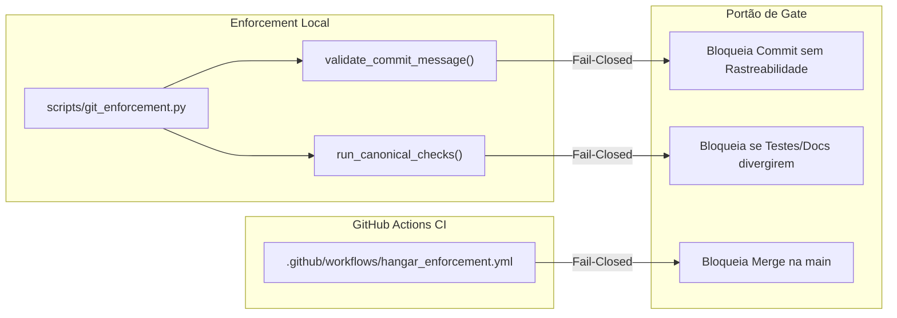

# 12_GIT_ENFORCEMENT_FOUNDATION.md — Fundação Git Determinística e CI Enforcement

## 1. Contexto e Soberania
- **Artefato:** `DOCS/12_GIT_ENFORCEMENT_FOUNDATION.md`
- **Origem:** `CALL-HANGAR-GIT-ENFORCEMENT-FOUNDATION-001` (`CG-000105`) reatada por `CALL-HANGAR-GIT-ENFORCEMENT-FOUNDATION-RESUME-001` (`CG-000111`)
- **Princípio:** O Git atua como barramento determinístico de dados, repositório auditável de evidências e motor de enforcement (portas de gate). Em conformidade com o [`10_PURPOSE_FIRST_INVARIANT.md`](10_PURPOSE_FIRST_INVARIANT.md), o Git complementa a Planta, a Governança, os Testes e o Kanban, sem substituir nenhum deles.

---

## 2. Componentes da Fundação Git Determinística

### A. Commits Semânticos com Rastreabilidade Mandatória
Todo commit no repositório `BNeto04/Hangar_v1` deve seguir a sintaxe semântica canônica contendo explicitamente o identificador do Card, Intent ou endereço Down Plant:
- **Formato:** `<tipo>(<escopo>): <descrição> [CARD_ID: ... | INTENT_ID: ... | PLANT: ...]`
- **Tipos Autorizados:** `feat`, `fix`, `docs`, `chore`, `test`, `refactor`, `style`, `ci`.
- **Fail-Closed:** Qualquer commit sem rastreabilidade é rejeitado antes de mutar o branch.

### B. Motor Canônico de Verificação (`scripts/git_enforcement.py`)
Executa deterministicamente:
1. **Invariantes da Árvore Documental:** Zero documentos `.md` soltos na raiz (salvo `README.md` e `CUTOVER_MANIFEST.md`).
2. **Invariantes do Vault:** 11 seções top-level canônicas rigorosamente intactas.
3. **Integridade do Kanban:** Validação matemática de `total_cards == len(cards)` no espelho Git.
4. **Suíte de Testes Determinísticos:** Execução da suíte `test_hangar_v1_sprint_01.py` (7/7 PASS obrigatório).

### C. Workflow GitHub Actions (`.github/workflows/hangar_enforcement.yml`)
Configurado para rodar a cada push e PR para a branch `main`, atuando como status check obrigatório para pull requests.

---

## 3. Evidências de Comprovação (PASS e FAIL Bloqueado)

| Caso de Teste | Entrada | Resultado Esperado | Resultado Real |
| :--- | :--- | :---: | :---: |
| **PASS: Commit Semântico Válido** | `feat(bridge): ... [CARD_ID: t_hangar_git_enforcement_01]` | `True` | **`PASS`** |
| **FAIL: Sem Rastreabilidade** | `feat(bridge): adiciona arquivos` | `False (Rejeitado)` | **`FAIL (BLOQUEADO)`** |
| **FAIL: Tipo Inválido** | `badtype(something): faz algo [CARD_ID: t_01]` | `False (Rejeitado)` | **`FAIL (BLOQUEADO)`** |
| **PASS: Suite & Invariantes** | `python scripts/git_enforcement.py check-all` | `status: PASS` | **`PASS (100% OK)`** |

---

## 4. Invariantes de Governança
1. **Nenhum check promove T5 sozinho:** O CI e os scripts de enforcement validam integridade técnica (T4). A promoção para T5 permanece privilégio soberano do Proprietário.
2. **Fail-Closed Estrito:** Se qualquer check obrigatório falhar ou estiver indisponível, o avanço é bloqueado.
3. **Preservação da Bridge:** A Pull Request #1 permanece como barramento permanente de mensagens ChatGPT <-> Antigravity.
