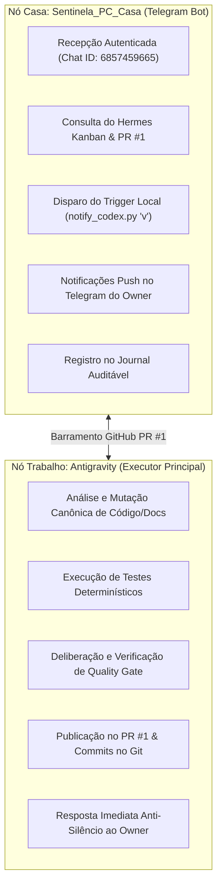

# 13_OWNER_SOVEREIGNTY_AND_BOT_POWERS.md — Soberania do Owner, Matriz de Poderes Reais e Regra Anti-Silêncio

## 1. Contexto e Soberania
- **Artefato:** `DOCS/13_OWNER_SOVEREIGNTY_AND_BOT_POWERS.md`
- **Origem:** `CALL-BRIDGE-OWNER-SOVEREIGNTY-BOT-POWERS-001` (`CG-000113`)
- **Princípio Fundamental:** O Proprietário é a autoridade soberana e primária do Hangar V1. Nenhuma auditoria pendente, rotina de pareceristas ou espera por LLMs pode impor silêncio ou bloquear comandos explicitamente autorizados pelo Proprietário.

---

## 2. Regra de Precedência Soberana

$$\mathbf{OWNER\_DIRECTIVE} \succ \mathbf{Fila\_Interna} \succ \mathbf{Auditoria\_Pendente} \succ \mathbf{Rotina\_Operacional}$$

### Princípios Operacionais:
1. **Regra Anti-Silêncio:** Quando o Proprietário envia um comando (como `v`, `/status` ou uma diretiva), o sistema deve responder de forma **imediata e factual**, reportando o estado corrente sem ocultar informações.
2. **Tratamento de Bloqueios:** Se uma ação solicitada pelo Owner violar invariantes técnicos de segurança (`SAFETY_VIOLATION`) ou exceder limites canônicos (`SCOPE_VIOLATION`), a execução é retida em `HOLD`, mas o motivo é comunicado **imediatamente como bloqueio factual**, nunca como precedência de terceiros sobre o Owner.

---

## 3. Matriz de Poderes Reais do Ecossistema

### Detalhamento dos Poderes:

| Agente / Nó | Poderes Reais Autorizados | Limitações e Proibições |
| :--- | :--- | :--- |
| **`Sentinela_PC_Casa`** | • Recepção autenticada de comandos do Owner. • Consulta síncrona do Kanban e PR #1. • Disparo do autowake/Codex via `/disparar`. • Notificações push ao Proprietário via Telegram. • Append no journal `conversa persistente.txt`. | • **Proibido:** Modificação direta de código ou banco. • **Proibido:** Promoção de cards sem gate formal. • **Proibido:** Comunicação com usuários não-autorizados (Fail-Closed). |
| **`Antigravity`** | • Engenharia de software e implementação de código. • Execução determinística de testes. • Gestão do Hermes Kanban e espelho Git. • Publicação formal de envelopes `AG-RES`. • Resposta imediata ao Proprietário. | • **Proibido:** Silêncio em auditoria quando o Owner indaga. • **Proibido:** Promoção T5 sem ordem soberana. • **Proibido:** Mutação fora da Planta canônica. |

---

## 4. Evidências de Validação E2E

Executada suíte `test_owner_sovereignty_e2e.py` com 5/5 testes aprovados:
1. **`PASS Autorizado`:** Diretiva do Owner acolhida imediatamente sem bloqueio por auditoria pendente.
2. **`HOLD Legítimo (Safety)`:** Tentativa de violação de segurança bloqueada factualmente com resposta imediata.
3. **`HOLD Legítimo (Scope)`:** Tentativa de mutação fora de escopo bloqueada factualmente com resposta imediata.
4. **`Fila Padrão`:** Rotinas internas de agentes aguardam auditoria pendente.
5. **`Matriz de Poderes`:** Validação da integridade estrutural das capacidades autorizadas.
