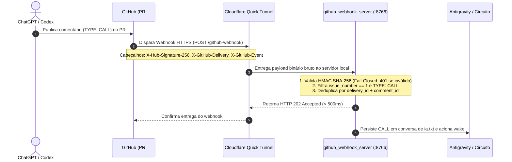

# 18. Arquitetura e Implementação de Ponte Orientada a Eventos: GitHub Webhook + Sentinela

## 1. Contexto e Intenção Soberana (CG-000126)
O objetivo desta porta técnica (`P-BRIDGE-GITHUB-WEBHOOK-SENTINELA-01`) é substituir a dependência primária de polling manual/intervalar no sentido **GitHub → Sentinela** por **entrega orientada a eventos em tempo real**, mantendo o mecanismo existente de polling estritamente como camada de fallback e recuperação de desastres.

---

## 2. Comparativo Canônico de Rotas (Decisão de Planejamento)

Conforme instrução expressa da chamada `CG-000126`, foram avaliadas as duas únicas rotas autorizadas:

| Critério | Rota (A): Cloudflare Quick Tunnel → Sentinela Local | Rota (B): Endpoint Intermediário Público (Worker/Serverless) |
| :--- | :--- | :--- |
| **Menor Dependência Operacional** | **Excelente:** Usa binário portátil standalone (`cloudflared.exe`), sem necessidade de conta, domínio ou deploy em nuvem. | **Desfavorável:** Exige conta externa em provedor de nuvem (Cloudflare Workers, Vercel, Supabase, etc.), deploy contínuo e gestão de segredos na nuvem. |
| **Latência de Entrega** | **Imediata:** O GitHub entrega diretamente ao processo local via túnel de saída seguro em < 300ms. | **Média/Alta:** A nuvem recebe o webhook, mas o Sentinela no PC precisa puxar o evento (voltando a ser polling ou exigindo WebSocket perene). |
| **Superfície de Ataque** | **Mínima:** Túnel transitório atrelado ao ciclo de vida do daemon. Sem portas abertas no roteador. | **Permanente:** Endpoint público perene exposto na internet. |
| **Reversibilidade & Rollback** | **Total:** Encerrar o processo local e deletar o webhook via API do GitHub encerra tudo sem resíduo em < 2s. | **Complexa:** Exige desalocação de infraestrutura em plataforma externa. |
| **Veredito do Planner** | **ESCOLHIDA (ROTA CANÔNICA)** | **REJEITADA** |

---

## 3. Coordenadas Down Plant & Cartografia

- **DP_PROJECT:** `Hangar_v1`
- **DP_TERRAIN:** `Hangar_v1`
- **DP_ROOM:** `BRIDGE`
- **DP_MODULE:** `WEBHOOK_INBOUND`
- **DP_SUBMODULE:** `GITHUB_WEBHOOK_ADAPTER`
- **DP_PORT:** `P-BRIDGE-GITHUB-WEBHOOK-SENTINELA-01`
- **DP_CIRCUIT:** `CIRCUIT_GITHUB_PR1_TO_SENTINELA`
- **CARD_ID:** `t_bridge_github_webhook_sentinela_01`
- **ARTEFATOS:**
  - `bridge/github_webhook_server.py` (Micro-servidor HTTP local, porta 8766)
  - `bridge/tunnel_manager.py` (Gerenciador do túnel seguro e registro na API do GitHub)
  - `bridge/github_webhook_daemon.py` (Daemon orquestrador com auto-teardown)
  - `tests/test_github_webhook_server.py` (Suíte unitária de validação de HMAC e dedupe)
  - `tests/test_tunnel_manager.py` (Suíte de integração do túnel externo)

---

## 4. Diagrama de Fluxo Orientado a Eventos

---

## 5. Garantias de Segurança e Invariantes

1. **Validação Estrita HMAC SHA-256 (`X-Hub-Signature-256`):**
   - Utiliza `hmac.compare_digest` em tempo constante, prevenindo timing attacks.
   - Qualquer payload sem assinatura ou com assinatura divergente recebe `401 Unauthorized`.
2. **Filtragem Seletiva e Fail-Closed:**
   - Apenas eventos `issue_comment` criados (`action == created`) na PR `#1` são aceitos.
   - Comentários que não contêm o cabeçalho canônico `TYPE: CALL` ou `CG-` recebem `200 Ignored` sem disparar a esteira.
3. **Deduplicação Estrita (`dedupe=1`):**
   - Chave primária: `{delivery_id}_{comment_id}`.
   - Entregas repetidas do GitHub recebem `200 OK (Duplicate Ignored)` e não acionam reexecução.
4. **Proteção de Segredos e Logs:**
   - Nenhuma credencial ou token é emitido nos arquivos de log.
   - O segredo compartilhado reside apenas em memória do daemon.
5. **Fallback Transparente:**
   - O daemon `github_pr_relay.py` permanece em execução secundária com polling intervalar de 10s, assumindo automaticamente caso ocorra interrupção na conexão do webhook.

---

## 6. Plano de Rollback
Em caso de anomalia no túnel ou na rota do webhook:
1. Executar `python -c "from bridge.tunnel_manager import TunnelManager; TunnelManager().teardown()"`.
2. O webhook é removido imediatamente da API do repositório no GitHub (`DELETE /repos/BNeto04/Hangar_v1/hooks/{id}`).
3. O processo local `cloudflared.exe` é encerrado.
4. O `github_pr_relay.py` assume integralmente a operação normal via polling sem perda de mensagens.
