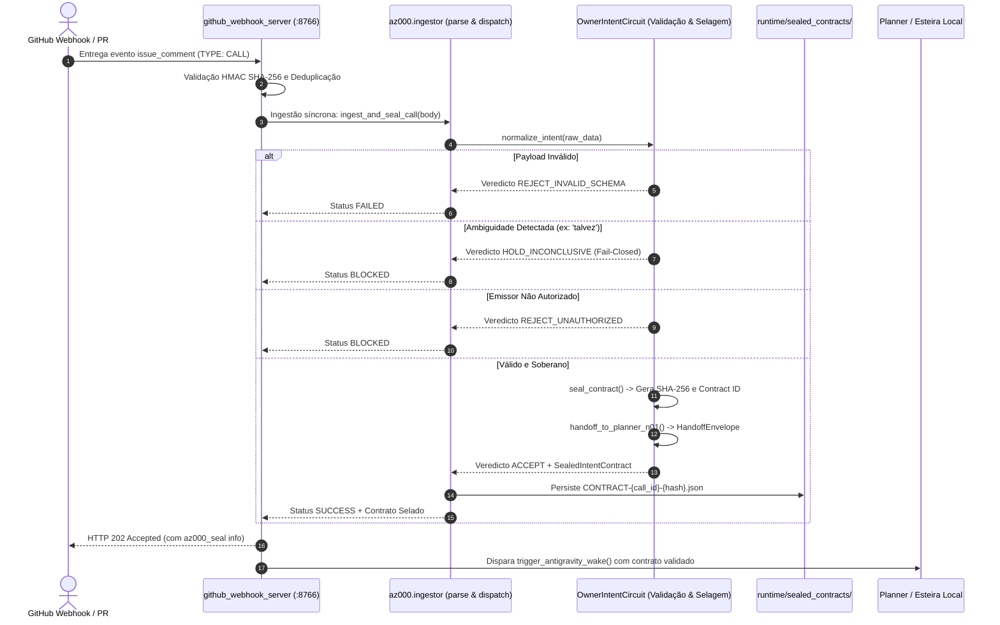

# 19. Integração Funcional do Circuito AZ000 Owner Intent na Recepção da Ponte

## 1. Contexto e Intenção Soberana (CG-000128)
Após a homologação e comprovação ao vivo da ponte orientada a eventos via GitHub Webhook (`CG-000127` / `AG-RES-000126`), a diretriz canônica estabelecida na chamada `CG-000128` determinou a continuidade do fluxo operacional com uma tarefa de valor sistêmico real:
**Conectar o transporte de recepção comprovado ao circuito de governança soberana AZ000 (Owner Intent).**

O princípio soberano fundamental é a invariante:
> **`NO_UNSEALED_PASS`**: Nenhuma instrução, comando ou chamada recebida de agente externo (ChatGPT, GitHub, Telegram, etc.) pode ser encaminhada para o Planner (`MOCK-TERRAIN/Hangar/CharPlanner/Core:P-PLAN-01`) ou executada sem antes passar pela esteira determinística de validação fail-closed e receber um selo criptográfico imutável SHA-256 (`SealedIntentContract`).

---

## 2. Coordenadas Down Plant & Cartografia

- **DP_PROJECT:** `Hangar_v1`
- **DP_TERRAIN:** `Hangar_v1`
- **DP_ROOM:** `AZ000_GOVERNANCA_SOBERANIA`
- **DP_MODULE:** `OWNER_INTENT`
- **DP_SUBMODULE:** `SEALED_CONTRACT_EMITTER`
- **DP_PORT:** `P-INTENT-HANDOFF-N01-01`
- **DP_CIRCUIT:** `CIRCUIT_OWNER_INTENT_TO_PLANNER`
- **CARD_ID:** `t_hangar_az000_intent_seal_ingestion_01`
- **ARTEFATOS:**
  - `az000_governance/owner_intent/contracts.py` (Contratos imutáveis e verificador criptográfico)
  - `az000_governance/owner_intent/circuit.py` (Esteira determinística de validação, selagem e handoff)
  - `az000_governance/owner_intent/ingestor.py` (Adaptador de ingestão de envelopes brutos e persistência)
  - `bridge/github_webhook_server.py` (Recepção HTTP com invocação síncrona do selador AZ000)
  - `tests/test_az000_bridge_ingestor.py` (Suíte unitária de testes do pipeline de selagem)
  - `runtime/sealed_contracts/*.json` (Armazenamento permanente dos contratos selados)

---

## 3. Diagrama de Fluxo de Ingestão e Selagem Criptográfica



---

## 4. Estrutura do Contrato Selado (`SealedIntentContract`)

O contrato gerado é determinístico e imutável. Exemplo de contrato gerado para a chamada `CG-000128`:

```json
{
  "schema": "AZ000-OWNER-INTENT-SEALED-CONTRACT-1",
  "contract_id": "CONTRACT-CALL-HANGAR-CONTINUOUS-FLOW-NEXT-CYCLE-001-FDFED42F",
  "call_id": "CALL-HANGAR-CONTINUOUS-FLOW-NEXT-CYCLE-001",
  "owner_id": "CHATGPT",
  "action": "CONTINUE_WITH_NEXT_USEFUL_TASK",
  "scope": "Hangar_v1",
  "directives": [
    "OWNER_DIRECTIVE: TRUE",
    "DP_PROJECT: Hangar_v1"
  ],
  "mode": "LOCAL_CHAR_SLM_ONLY; ANTIGRAVITY_OBSERVE_ONLY",
  "route": "N01>N02>HERMES>N03>N10>N09>N08>N07",
  "created_at_iso": "2026-09-05T02:07:33.131277+00:00",
  "contract_sha256": "3327017441cfc055832e30f25fa086953d6c76a2295b308653780b9ae914d406",
  "validation_verdict": "ACCEPT"
}
```

### Invariantes Garantidas pelo Método `verify_integrity()`:
1. Re-ordena todas as chaves do contrato canônico via `sort_keys=True`.
2. Computa o hash `hashlib.sha256` sobre o payload UTF-8.
3. Se qualquer campo (ação, escopo, diretivas, emissor ou timestamp) for adulterado por terceiros, `verify_integrity()` retorna `False`, travando a esteira em fail-closed.

---

## 5. Matriz de Evidências de Teste

| Teste | Objetivo | Resultado |
| :--- | :--- | :--- |
| `test_01_parse_raw_call_envelope` | Valida extração canônica de CALL_ID, OWNER, ACTION, SCOPE e DIRECTIVES | **PASS (OK)** |
| `test_02_ingest_and_seal_valid_call` | Valida selagem SHA-256 completa, persistência em disco e envelope de handoff | **PASS (OK)** |
| `test_03_reject_missing_call_id` | Valida rejeição fail-closed para esquemas sem CALL_ID | **PASS (OK)** |
| `test_04_reject_unauthorized_owner` | Rejeita emissores fora da lista soberana autorizada (`REJECT_UNAUTHORIZED`) | **PASS (OK)** |
| `test_05_hold_ambiguous_directive` | Bloqueia diretivas com termos ambíguos proibidos (`HOLD_INCONCLUSIVE`) | **PASS (OK)** |
| `test_06_reject_unauthorized_scope` | Rejeita tentativas de mutação de escopo fora do Hangar V1 (`OUT_OF_BOUNDS_SCOPE`) | **PASS (OK)** |
| `test_github_webhook_server` | Validação de integração: Webhook executa ingestor e anexa selo na resposta 202 | **PASS (OK - 8/8)** |
