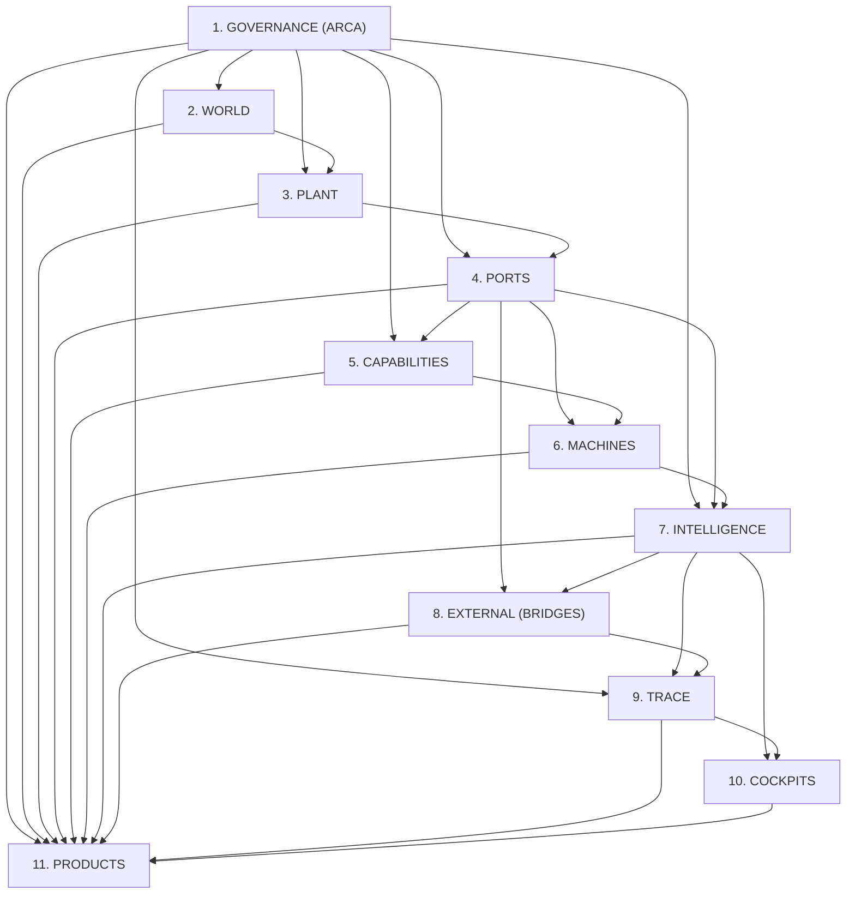

# 20. Especificação Canônica do Módulo ARCA e Política de Ordem de Cômodos

## 1. Origem e Intenção Soberana (CG-000129)
Atendendo à diretriz canônica estabelecida na chamada `CG-000129` (`CALL-HANGAR-ROOM-SPECS-ARCA-DOMAIN-RULES-001`), esta especificação formaliza a criação do módulo **ARCA** dentro de Governança e a política de execução e fechamento de SPECs estritamente por **CÔMODO**.

---

## 2. Coordenadas Down Plant & Cartografia
- **DP_PROJECT:** `Hangar_v1`
- **DP_TERRAIN:** `Hangar_v1`
- **DP_ROOM:** `AZ000_GOVERNANCA_SOBERANIA` (ou `GOVERNANCE`)
- **DP_MODULE:** `ARCA`
- **DP_SUBMODULE:** `DOMAIN_RULES`
- **DP_PORT:** `P-GOV-ARCA-RULES-01`
- **CARD_ID:** `t_hangar_arca_governance_domain_rules_01`
- **ARTEFATOS:**
  - Código: `az000_governance/arca/canonical_domain_rules.py`
  - Pacote: `az000_governance/arca/__init__.py`
  - Vault: `vault/GOVERNANCE/ARCA_DOMAIN_RULES.md`
  - Testes: `tests/test_arca_domain_rules.py`

---

## 3. As 7 Regras de Domínio Fundamentais da ARCA
1. `R-DOM-001 (SOBERANIA_PROPRIETARIO)`: Monopólio decisório irrevogável do Proprietário.
2. `R-DOM-002 (FAIL_CLOSED_SYSTEMIC)`: Abortar transições perante qualquer incerteza ou falha de prova.
3. `R-DOM-003 (NO_UNSEALED_PASS)`: Obrigatoriedade de selagem criptográfica SHA-256 no AZ000.
4. `R-DOM-004 (NO_SPEC_NO_CODE)`: Mutação vinculada a SPEC prévia e card visível no Kanban.
5. `R-DOM-005 (ROOM_BY_ROOM_ORDER)`: Execução e fechamento integral por cômodo antes do próximo.
6. `R-DOM-006 (SINGLE_SOURCE_OF_TRUTH_ARCA)`: Unicidade das regras de domínio na ARCA sem duplicação local.
7. `R-DOM-007 (EVIDENCE_FIRST_PROMOTION)`: Promoção para T5 somente com prova factual auditada.

---

## 4. Grafo de Dependências e Ordem de Fechamento por Cômodo

---

## 5. Garantias Criptográficas da ARCA
A função `compute_arca_sha256()` gera um hash canônico determinístico sobre o dicionário ordenado de todas as regras e cômodos, permitindo que qualquer lente ou auditor (N08/N06/N07) comprove instantaneamente que nenhuma regra de domínio foi adulterada.
